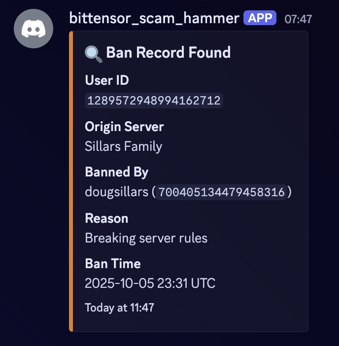
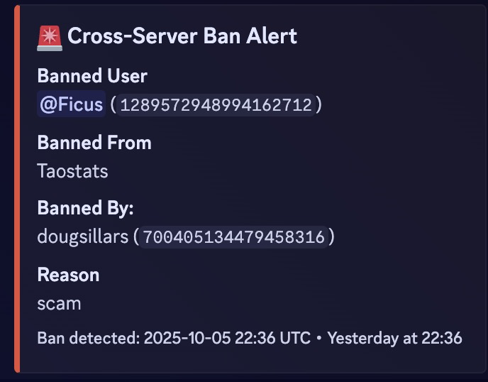
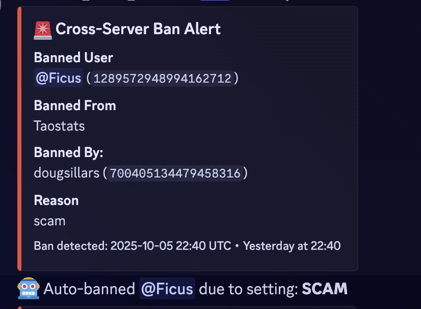
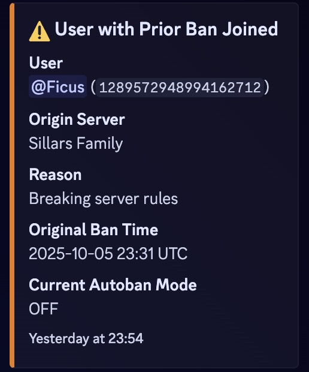

# Bittensor Scam Hammer

## Why banhammer
There is a group of Discord moderators who alert one another if there are scammers in each others Discord servers.

This Discord bot looks to automate this notification - improving the Discord experience for users, and making life easier for mods.

## Interacting with Banhammer

1. Server owners can decide how automated the bans can be.  

```
!autoban [off|scam|on]
```
* off - no automatic bans. (you still get alerts of bans) 
* scam - if *scam* in the reason - they will be banned.
* on - if banned elsewhere - automatically ban


2. You can check your autoban setting:

```
!getautoban
```

✅ Autoban mode set to ON for this server.

3. check if a userID has been banned, and why:

```
!searchban 1289572948994162712
```


## How banhammer works

### Active ban
When a mod bans a user in their Discord, the banhammer server receives the ban.  It gets inserted into a postgres table.

Banhammer then searches the **other** servers to see if the banned user is a member.  If the banned user is found in another server, an alert is sent:



If your autoban settings allow for it - they will be banned automatically.



### New member

When a new member joins your Discord server, Banhammer checks the DB to see if they have a ban record.

If there is a ban record from another server, you will receive an alert


If your autban settings allow for it - they will be autobanned.


## Install

This url will install the banhammer bot:
https://discord.com/oauth2/authorize?client_id=1423668856836063313&scope=bot%20applications.commands&permissions=1099780409476

On install- you can deny banning privileges, if desired.

Things to do in your server:

* Create `mod_alerts` channel. This is where the automated alerts will come in.  Make sure that this channel is visible to mods/admins only.
* In the role hierarchy, make sure that the banhammer bot is **above** any role that it can ban.
For example, in the Taostats server, users must have the **verified** role befor ethey can chat.
In this example, the bot CANNOT ban verified users: it is lower hierarchy:


Here, the banhammer **CAN** ban them - since the scam_hammer bot is higher in the list.


* Set your autoban setting:

Example:

`!autoban off`